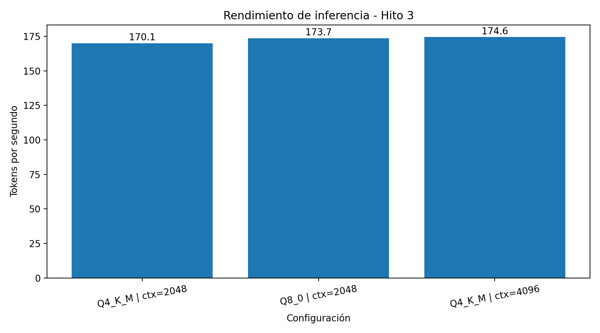

# Hito 3 — Inferencia de un LLM en GPU

## Objetivo

En este hito se busca ejecutar un modelo de lenguaje cuantizado utilizando la GPU y analizar cómo cambian el rendimiento y el uso de memoria según la configuración utilizada.

Para las pruebas se utilizó `llama.cpp` con aceleración CUDA y el modelo **Qwen2.5-0.5B-Instruct** en formato GGUF.

## Entorno utilizado

- GPU: NVIDIA Tesla T4
- Memoria de GPU: 15 GB
- CUDA Toolkit: 12.8
- Runtime: llama.cpp
- Modelo: Qwen2.5-0.5B-Instruct
- Cuantizaciones utilizadas:
  - Q4_K_M
  - Q8_0

El modelo se ejecutó con todas sus capas descargadas en la GPU mediante `-ngl 99`.

## Metodología

Se realizaron tres configuraciones:

| Cuantización | Batch | Contexto |
|---|---:|---:|
| Q4_K_M | 512 | 2048 |
| Q8_0 | 512 | 2048 |
| Q4_K_M | 512 | 4096 |

Cada configuración se ejecutó **3 veces**.

Como métrica de rendimiento se utilizó la velocidad de generación informada por `llama.cpp`, expresada en **tokens por segundo (tokens/s)**.

Además, el script consulta periódicamente `nvidia-smi` para registrar la máxima VRAM utilizada por el proceso durante la ejecución.

Para representar el rendimiento de cada configuración se utilizó la **mediana de las tres ejecuciones**, para reducir el efecto de variaciones puntuales entre ejecuciones.

## Resultados

### Mediciones realizadas

Los resultados completos se encuentran en `resultados.csv`.

| Cuantización | Batch | Contexto | Velocidad (tokens/s) | VRAM (MiB) |
|---|---:|---:|---:|---:|
| Q4_K_M | 512 | 2048 | 170,1 | 554 |
| Q8_0 | 512 | 2048 | 173,7 | 682 |
| Q4_K_M | 512 | 4096 | 174,6 | 580 |



**Modelo:** Qwen2.5-0.5B-Instruct  
**GPU:** NVIDIA Tesla T4  
**Batch:** 512  
**Velocidad:** mediana de 3 ejecuciones.

## Análisis

### Efecto de la cuantización

Al comparar Q4_K_M y Q8_0 con el mismo contexto de 2048 y batch de 512, Q4_K_M utilizó **554 MiB de VRAM**, mientras que Q8_0 utilizó **682 MiB**.

La cuantización Q4 utiliza menos bits para representar los pesos del modelo, por lo que necesita menos memoria para almacenarlos. Q8 utiliza una representación de mayor precisión y, en consecuencia, requiere más memoria.

En las mediciones realizadas, Q8_0 obtuvo una mediana de **173,7 tokens/s**, mientras que Q4_K_M obtuvo **170,1 tokens/s**. La diferencia es pequeña, por lo que estos resultados no permiten afirmar que Q8 sea inherentemente más rápido. En este modelo y hardware, la variación entre ejecuciones tiene un efecto importante.

### Efecto del contexto

Al mantener Q4_K_M y batch 512, se compararon contextos de 2048 y 4096.

El uso de VRAM pasó de **554 MiB a 580 MiB**. En cuanto al rendimiento, las medianas fueron **170,1 tokens/s** y **174,6 tokens/s**, respectivamente.

En esta prueba no se observa una disminución clara del rendimiento al aumentar el contexto. Esto no significa que un contexto mayor siempre sea más rápido: la diferencia es pequeña y puede estar influida por la variabilidad de las ejecuciones y por la forma en que el runtime administra la memoria.

### Batch

El tamaño de lote se mantuvo fijo en **512** durante todas las pruebas. Por lo tanto, el experimento no permite medir directamente el efecto de cambiar el batch.

Se mantuvo constante para poder analizar por separado los cambios de cuantización y contexto.

## Relación con la Unidad II

La ejecución del modelo en GPU aprovecha el modelo **SIMT (Single Instruction, Multiple Threads)**. La GPU ejecuta muchas operaciones similares en paralelo, algo adecuado para las operaciones matriciales y vectoriales utilizadas por los modelos de lenguaje.

Los pesos del modelo y las estructuras utilizadas durante la inferencia deben ser accedidos desde la jerarquía de memoria de la GPU. El uso de cuantización reduce el tamaño de los pesos y, por lo tanto, la cantidad de memoria necesaria para almacenarlos.

En este experimento, Q8_0 utilizó 128 MiB más de VRAM que Q4_K_M con el mismo contexto. Sin embargo, el rendimiento de generación fue muy parecido.

Por los resultados obtenidos no se puede afirmar de forma concluyente que esta inferencia sea **memory-bound** o **compute-bound**. Para realizar esa clasificación con mayor precisión sería necesario realizar un perfilado a nivel de kernels, como el realizado en el Hito 2.

## Conclusión

Las pruebas permitieron ejecutar un modelo de lenguaje cuantizado en una NVIDIA Tesla T4 y medir tanto su velocidad de generación como el uso de VRAM.

La cuantización Q4_K_M redujo el uso de memoria respecto de Q8_0, mientras que las velocidades de generación obtenidas fueron similares en las condiciones evaluadas.

El aumento del contexto de 2048 a 4096 produjo un incremento moderado del uso de VRAM y no mostró una penalización clara de rendimiento en estas mediciones.

Los resultados muestran que la configuración del modelo y de la inferencia afecta el uso de los recursos de GPU, pero también que las diferencias pequeñas deben interpretarse considerando la variabilidad propia de las ejecuciones.

## Reproducción

Las mediciones se realizaron en Google Colab utilizando una NVIDIA Tesla T4, llama.cpp con soporte CUDA y los modelos Qwen2.5-0.5B-Instruct en formato GGUF.

Una vez preparado el entorno y descargados los modelos, el programa utilizado para realizar las mediciones es:

`medir_inferencia.py`

La ejecución se realiza con:

```bash
python medir_inferencia.py
```

Por defecto se realizan 3 repeticiones para cada configuración y los resultados se guardan en:

`resultados.csv`

El script utiliza llama.cpp con aceleración CUDA y mide la velocidad de generación y la máxima VRAM utilizada durante cada ejecución.
